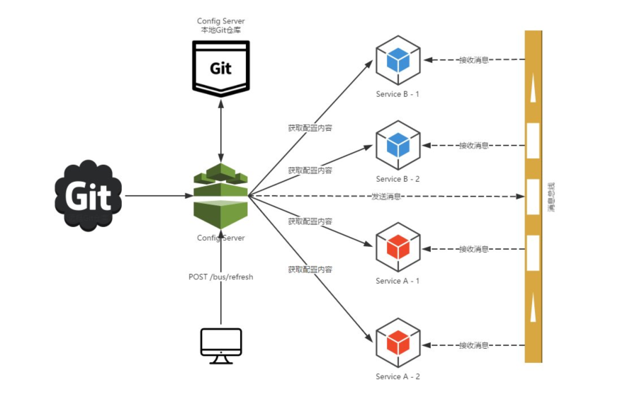
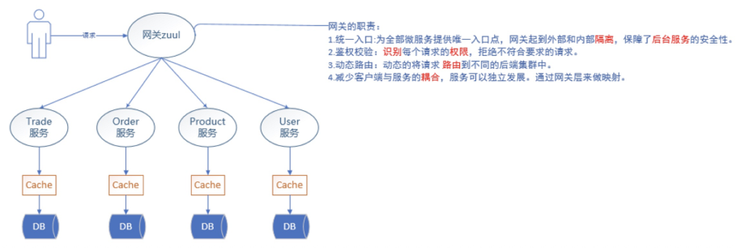
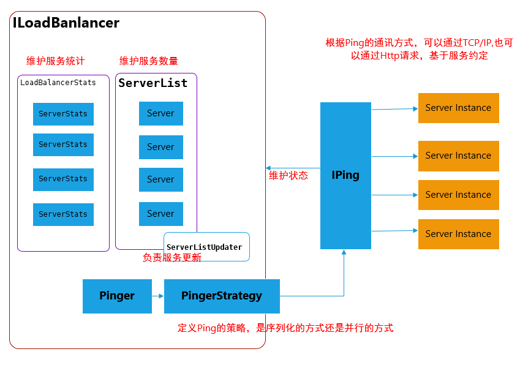
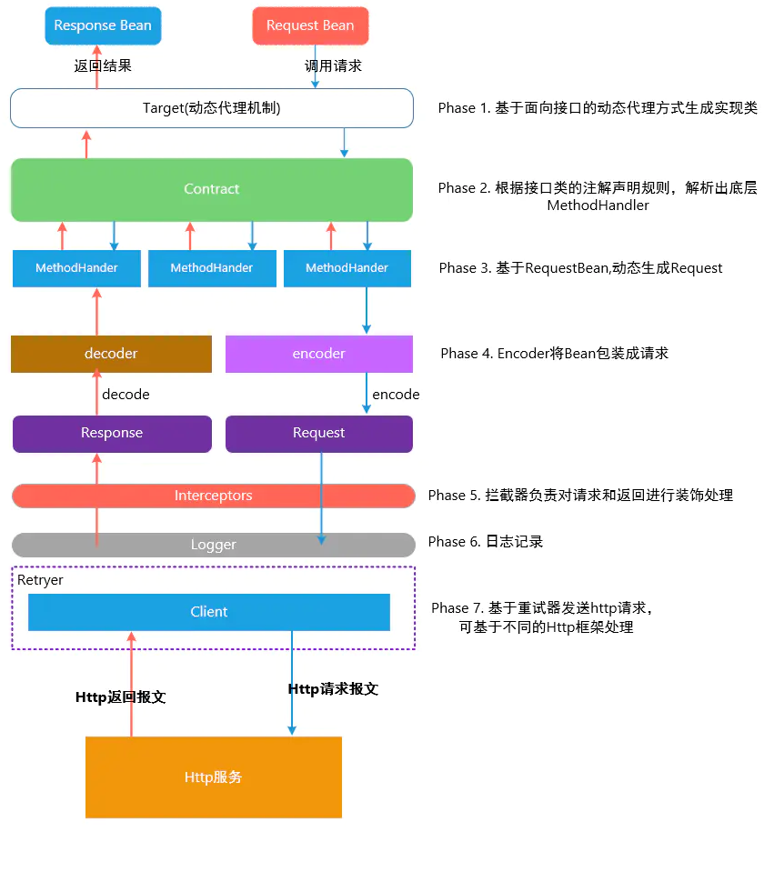
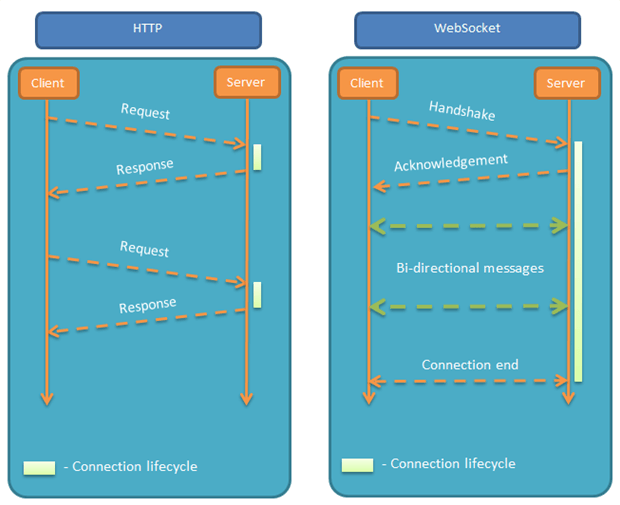
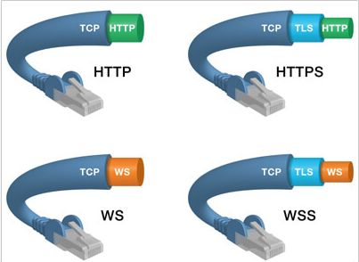

# cloudplatform
基于spring cloud的分布式系统

`注册中心`
`项目端口从注册中心的8020开始`
`框架服务使用8021-8030`
`公共服务使用8031-8040`
`业务服务使用8041-8050`

##### 技术选型:

### eureka作为注册中心:
`是 Netflix 开发的，一个基于 REST 服务的，服务注册与发现的组件它主要包括两个组件：Eureka Server 和 Eureka Client`
* Eureka Client：一个Java客户端，用于简化与 Eureka Server 的交互（通常就是微服务中的客户端和服务端）
* Eureka Server：提供服务注册和发现的能力（通常就是微服务中的注册中心）

- 同步：每个 Eureka Server 同时也是 Eureka Client（逻辑上的）多个 Eureka Server 之间通过复制的方式完成服务注册表的同步，形成 Eureka 的高可用
- 识别：Eureka Client 会缓存 Eureka Server 中的信息,即使所有 Eureka Server 节点都宕掉，服务消费者仍可使用缓存中的信息找到服务提供者
- 续约：微服务会周期性（默认30s）地向 Eureka Server 发送心跳以Renew（续约）信息（类似于heartbeat）
- 续期：Eureka Server 会定期（默认60s）执行一次失效服务检测功能,它会检查超过一定时间（默认90s）没有Renew的微服务，发现则会注销该微服务节点

config-server 配置中心:
`Spring Cloud 配置中心为分布式系统中的服务器端和客户端提供外部化配置支持。`
`工作原理如下图所示`

### zuul作为网关:

* 统一入口：未全部为服务提供一个唯一的入口，网关起到外部和内部隔离的作用，保障了后台服务的安全性。
* 鉴权校验：识别每个请求的权限，拒绝不符合要求的请求。
* 动态路由：动态的将请求路由到不同的后端集群中。
* 减少客户端与服务端的耦合：服务可以独立发展，通过网关层来做映射。

### ribbon负载均衡:

`当集群里的1台或者多台服务器down的时候，剩余的没有down的服务器可以保证服务的继续使用
使用了更多的机器保证了机器的良性使用，不会由于某一高峰时刻导致系统cpu急剧上升`

负载均衡有好几种实现策略，常见的有：

* 随机 (Random)
* 轮询 (RoundRobin)
* 一致性哈希 (ConsistentHash)
* 哈希 (Hash)
* 加权（Weighted）

### feign远程调用:

设计原理:https://www.jianshu.com/p/8c7b92b4396c

### websocket服务:

`服务器可以主动向客户端推送信息，客户端也可以主动向服务器发送信息，是真正的双向平等对话，属于服务器推送技术的一种。`

教程:http://www.ruanyifeng.com/blog/2017/05/websocket.html

### redis服务:

原理:https://www.cnblogs.com/xiufengchen/p/10455288.html

* 什么是redis
* redis的使用
* string与hash的数据差别
* redis的持久化方式:RDB（默认）和AOF
* redis单线程为什么这么快
  - redis是单线程的，但是为什么还是这么快呢，
  - 原因1： 单线程，避免线程之间的竞争
  - 原因2 ：是内存中的，使用内存的，可以减少磁盘的io
  - 原因3：多路复用模型，用了缓冲区的概念，selector模型来进行的
* redis主挂了怎么操作
* redis集群
* 内存淘汰策略
  ` Redis的内存淘汰策略是指在Redis的用于缓存的内存不足时，怎么处理需要新写入且需要申请额外空间的数据。`
  - noeviction：当内存不足以容纳新写入数据时，新写入操作会报错。
  - allkeys-lru：当内存不足以容纳新写入数据时，在键空间中，移除最近最少使用的key。
  - allkeys-random：当内存不足以容纳新写入数据时，在键空间中，随机移除某个key。
  - volatile-lru：当内存不足以容纳新写入数据时，在设置了过期时间的键空间中，移除最近最少使用的key。
  - volatile-random：当内存不足以容纳新写入数据时，在设置了过期时间的键空间中，随机移除某个key。
*
* 缓存击穿的解决方案
  - 原因：就是别人请求数据的时候，很多数据在缓存中无法查询到，直接进入数据查询，
  - 解决方法，对相关数据进行查询的数据只查询缓存，如果是一些特殊的可以进行数据库查询，也可以采用布隆过滤器进行查询
* 缓存雪崩的解决方案
  - 缓存雪崩的原因：一次性加入缓存的数据过多，导致内存过高，从而影响内存的使用导致服务宕机
  - 解决方法：1 redis集群，通过集群方式将数据放置.2 后端服务降级和限流：当一个接口请求次数过多，那么就会添加过多数据，可以对服务进行限流，限制访问的数量，这样就可以减少问题的出现

### 集成spring shell：
`Spring Shell项目的用户可以通过依赖Spring Shell jar并添加他们自己的命令（作为spring bean上的方法）轻松构建一个功能齐全的shell（也就是命令行）应用程序。创建命令行应用程序可能是有用的，例如与项目的REST API交互，或使用本地文件内容。`
* 一个简单的，注释驱动的编程模型，用于提供自定义命令
* 使用Spring Boot自动配置功能作为命令插件策略的基础
* 选项卡完成，着色和脚本执行
* 自定义命令提示符，shell历史文件名，结果和错误的处理
* 基于域特定标准动态启用命令
* 与bean验证API集成
* 已经内置命令，如清晰的屏幕，华丽的帮助，退出
* ASCII艺术表，带格式，对齐，花式边框等。

`consumer服务`使用`business`提供的服务，通过修改端口启动多个`business服务`，通过`ribbon`来`负载均衡`调用服务提供方的服务
